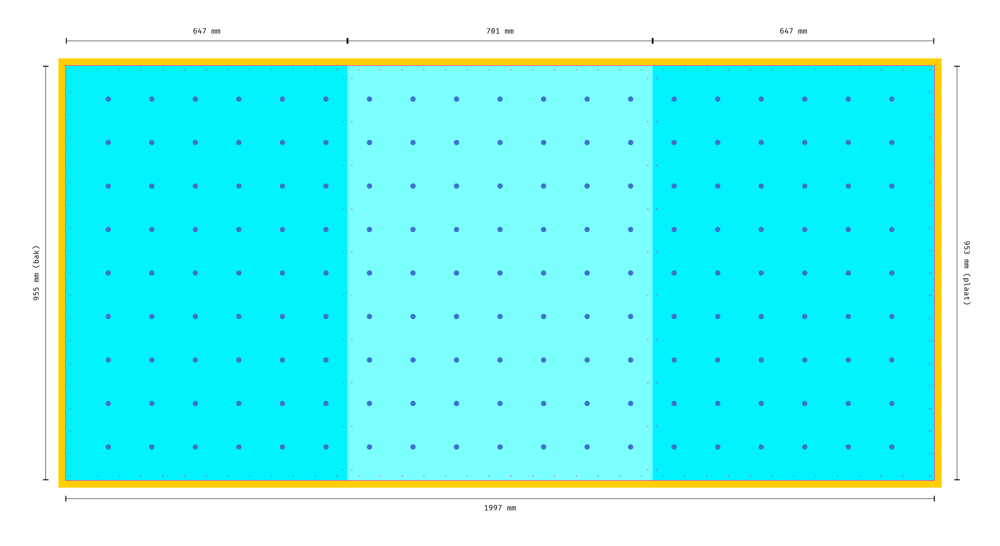

# Lichtbak

Ca. 2000 x 1200 mm

3 platen van 6 LEDs in de breedte X 11 LEDs in de hoogte. Dus 66 per plaat, in totaal 198.

Hartafstand tussen LEDs 100mm, zijkanten kader minstens 50.

Gaten LEDs wss ca. 12mm om ze goed te kunnen klemmen.

Houten buitenkader te maken van Douglas planken (Kurt)

Binnenmaat display 1990 x 1190 mm

Maat diffuser: 2000 x 1200 mm. Hierop is de buitenmaat van de bak gebaseerd. Diffuser wordt 5mm ingefreesd in het kader.

Mogelijke diffuser: https://shop.pyrasied.nl/product/greencast-opaal-acrylaat/

- Rug: 1898 x 1188

MDF plaat met leds: 3 identieke platen van 663 x 1188.

LEDS hebben een hartafstand van 100 mm, rondom de kader hanteren we een marge van ~60mm, afhankelijk van hoe dat uitkomt:

