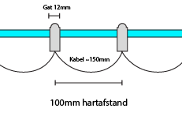

# Lichtbak

De *binnen*afmetingen van de bak zijn 1997 (b) x 955 (h) mm.

Gaten LEDs moeten ca. 12mm groot zijn om ze goed te kunnen klemmen.

Houten buitenkader te maken van Douglas planken.

Diffuser bestaat uit een kanaalplaat en vormt de basis van de afmetingen van de lichtbak.  
Diffuser wordt 5mm ingefreesd in het kader.

MDF plaat met leds: 3 platen, de buitenste smaller dan de middenste. Hartafstand tussen de LEDs is 100mm. Rondom zijn kleine 'voorgeboorde' gaten voor het bevestigen met schroeven.

* 2 platen van 647 x 953 mm, 6 LEDs breed en 9 LEDs hoog
* 1 plaat van 701 x 953 mm, 7 LEDs breed en 9 LEDs hoog

Er zijn dus in totaal 171 LEDs voorzien, en rondom is er 1 mm marge tussen de platen voor de LEDs en de wanden van de bak.

LEDS hebben een hartafstand van 100 mm:

## Elektronica

Plan is om de ESP en dus ook de stroomvoorziening binnen in het Fablab te hangen, en enkel de bekabeling voor de LEDs naar buiten te trekken.

We voorzien ~60mA stroomverbruik per LED, dus aan 198 LEDs komt dat op 60W in totaal. Hiervoor kunnen we een PC voeding gebruiken.
